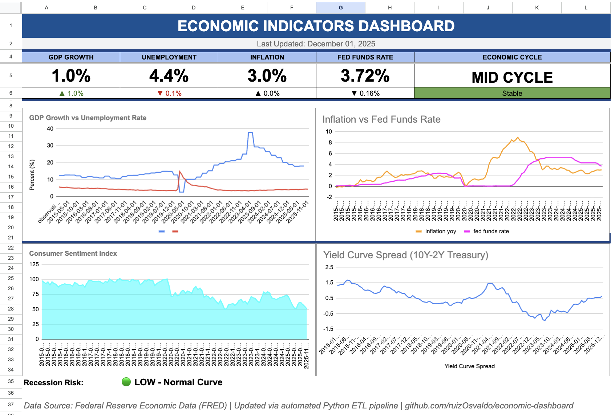

# Economic Indicators Analytics Dashboard

An end-to-end ETL pipeline and analytics dashboard tracking key U.S. economic indicators using Federal Reserve Economic Data (FRED).



## Overview

This project demonstrates a complete data engineering workflow:
- **Extract**: Pull economic data from FRED REST API
- **Transform**: Calculate derived metrics (YoY changes, rolling averages, z-scores)
- **Load**: Store in PostgreSQL database
- **Visualize**: Interactive Google Sheets dashboard with automated updates

## Economic Indicators Tracked

| Category | Indicators |
|----------|------------|
| **Output & Growth** | GDP, Industrial Production |
| **Labor Market** | Unemployment Rate, Initial Jobless Claims, Nonfarm Payrolls |
| **Inflation** | CPI, PCE Price Index |
| **Monetary Policy** | Fed Funds Rate, 10Y-2Y Treasury Spread, 10Y Treasury Rate |
| **Consumer** | Consumer Sentiment, Retail Sales |
| **Housing** | Housing Starts |

## Architecture
```
FRED API → Python ETL → PostgreSQL → SQL Analytics → Google Sheets Dashboard
```

## Technical Stack

- **Python**: pandas, SQLAlchemy, fredapi, gspread
- **Database**: PostgreSQL
- **Cloud**: Google Cloud Platform (Sheets API, Drive API)
- **SQL**: Window functions, CTEs, aggregations

## Key Features

### ETL Pipeline
- Automated data extraction from 13 FRED economic series
- Calculated metrics: MoM/YoY changes, rolling averages, z-scores
- Error handling for infinite values and missing data
- Upsert logic for incremental updates

### SQL Analytics
- Yield curve recession probability detection
- Economic cycle phase identification
- Forward-filling for quarterly data (GDP)
- Monthly aggregation of daily data

### Dashboard
- KPI cards with trend indicators
- GDP vs Unemployment trend analysis
- Inflation vs Fed Funds Rate comparison
- Consumer Sentiment tracking
- Yield Curve inversion monitoring (recession signal)

## Setup & Installation

### Prerequisites
- Python 3.9+
- PostgreSQL 14+
- FRED API Key (free at https://fred.stlouisfed.org/docs/api/api_key.html)
- Google Cloud service account

### Installation
```bash
# Clone repository
git clone https://github.com/ruizOsvaldo/economic-dashboard.git
cd economic-dashboard

# Create virtual environment
python3 -m venv venv
source venv/bin/activate

# Install dependencies
pip3 install -r requirements.txt

# Configure environment variables
cp .env.example .env
# Edit .env with your API keys and database credentials

# Initialize database
psql -d economic_indicators -f sql/schema.sql

# Run ETL pipeline
python3 src/etl_pipeline.py

# Export to Google Sheets
python3 src/export_to_sheets.py
```

## Project Structure
```
economic-dashboard/
├── src/
│   ├── etl_pipeline.py          # Main ETL pipeline
│   └── export_to_sheets.py      # Google Sheets export
├── sql/
│   ├── schema.sql               # Database schema
│   └── analysis_queries.sql     # Analytical queries
├── screenshots/
│   └── dashboard.png            # Dashboard screenshot
├── requirements.txt
├── .env.example
├── .gitignore
├── LICENSE
└── README.md
```

## Dashboard Preview

The dashboard displays:
- **GDP Growth**: Current growth rate with trend indicator
- **Unemployment**: Labor market health
- **Inflation**: CPI year-over-year change
- **Fed Funds Rate**: Current monetary policy stance
- **Economic Cycle**: Expansion, Mid Cycle, Late Cycle, or Recession
- **Yield Curve**: Recession probability indicator (negative = warning)

## Author

**Osvaldo Ruiz**
- LinkedIn: [linkedin.com/in/OsvaldoRuiz](https://linkedin.com/in/OsvaldoRuiz)
- GitHub: [github.com/ruizOsvaldo](https://github.com/ruizOsvaldo)
- Portfolio: [ruizosvaldo.github.io](https://ruizosvaldo.github.io)

## License

MIT License - see [LICENSE](LICENSE) file for details.
